<div align="center">


# 🇮🇳 Bharat Biz-Agent

### *AI-Powered Commerce Platform for Indian Kirana Stores*

[](https://neurathon.tech)
[](https://expo.dev)
[](https://supabase.com)
[](https://ai.google.dev)
[](https://n8n.io)
[](https://telegram.org)

---

> **A comprehensive, AI-driven platform** that empowers Kirana (neighbourhood grocery) store owners to manage sales, inventory, orders, customer credit (udhaar), and invoicing — through a **mobile app** and **Telegram bots** with **voice command support in Hindi/Hinglish/English**.

[📱 Mobile App](#mobile-app) · [🤖 AI Bots](#n8n-workflows--ai-agents) · [🗄️ Database](#database-schema) · [🚀 Quick Start](#quick-start) · [✨ Features](#key-features)

</div>

---

## 📑 Table of Contents

- [System Architecture](#system-architecture)
- [Tech Stack](#tech-stack)
- [Project Structure](#project-structure)
- [Mobile App](#mobile-app)
- [Database Schema](#database-schema)
- [n8n Workflows & AI Agents](#n8n-workflows--ai-agents)
- [PDF Invoice API](#pdf-invoice-api)
- [Edge Functions](#supabase-edge-functions)
- [Key Features](#key-features)
- [Quick Start](#quick-start)
- [Environment Variables](#environment-variables)
- [Security Considerations](#security-considerations)
- [Future Roadmap](#future-roadmap)

---

<a name="system-architecture"></a>
## 📐 System Architecture

```
┌─────────────────────────────────────────────────────────────────────────────┐
│                          🇮🇳  BHARAT BIZ-AGENT                               │
├────────────────┬──────────────────┬──────────────────┬──────────────────────┤
│   📱 Mobile    │   🤖 Telegram   │   📄 Invoice     │   🔔 Edge           │
│   App (Expo)   │   Bots (n8n)     │   API (Express)  │   Functions          │
├────────────────┴──────────────────┴──────────────────┴──────────────────────┤
│                     ☁️  Supabase (PostgreSQL + Realtime)                   │
│            Storage  •  Row Level Security  •  Webhooks  •  Auth             │
└─────────────────────────────────────────────────────────────────────────────┘
```

### 🔄 Data Flow

```
     👤 Customer (Telegram)                    🏪 Shopkeeper (Mobile App)
            │                                           │
            ▼                                           ▼
    ┌───────────────┐                          ┌──────────────────┐
    │  Customer Bot │◄── order_ongoing ───────►│  Orders Screen   │
    │ (n8n + Gemini)│    (Supabase RT)         │  (React Native)  │
    └───────┬───────┘                          └────────┬─────────┘
            │                                           │
            ▼                                           ▼
    📸 Payment Screenshot                      ✅ Confirm / ❌ Reject
            │                                           │
            ▼                                           ▼
    🤖 Gemini OCR ──→ Verify ──→ 🔔 Push Notification  │
            │                                           │
            ▼                                           ▼
    📄 Invoice PDF ◄────── Invoice API ◄────── Order Webhook (n8n)
    + 📱 UPI QR Code       (Puppeteer)
```

---

<a name="tech-stack"></a>
## 🛠️ Tech Stack

| Layer | Technology | Purpose |
|:---:|:---|:---|
| 📱 | **React Native (Expo SDK)** | Cross-platform mobile app |
| 🧭 | **Expo Router + MaterialTopTabs** | File-based routing with swipe navigation |
| ☁️ | **Supabase (PostgreSQL)** | Database, Realtime, Storage, Auth |
| 🧠 | **Google Gemini 2.5 Flash** | AI reasoning, voice transcription, OCR |
| ⚡ | **n8n (Self-hosted)** | Workflow automation engine |
| 💬 | **Telegram Bot API** | Customer & shopkeeper interfaces |
| 🎙️ | **Gemini Audio API** | Hindi/Hinglish voice transcription |
| 📄 | **Puppeteer (Express.js)** | HTML → PDF invoice generation |
| 🔗 | **TinyURL API** | Invoice URL shortening |
| 🔔 | **Expo Push + Edge Functions** | Real-time push notifications |
| 🌐 | **Custom i18n Context** | Bilingual UI (English + हिंदी) |

---

<a name="project-structure"></a>
## 📁 Project Structure

```
neurathon-final/
│
├── 📱 app/                              # React Native Expo Mobile App
│   ├── app/
│   │   ├── _layout.tsx                  # Root: fonts, splash, push notifs, realtime
│   │   ├── notifications.tsx            # Full notification center
│   │   └── (tabs)/
│   │       ├── _layout.tsx              # Bottom tab bar + header with 🔔
│   │       ├── index.tsx                # 📊 Dashboard (stats, quick sale/udhaar)
│   │       ├── orders.tsx               # 📦 Order management
│   │       ├── inventory.tsx            # 📋 Stock CRUD
│   │       ├── reports.tsx              # 📈 Sales analytics
│   │       └── profile.tsx              # 👤 Shop settings
│   ├── lib/
│   │   ├── supabase.ts                  # DB client + TypeScript interfaces
│   │   ├── api.ts                       # Business logic helpers
│   │   ├── i18n.tsx                     # EN/HI translations (50+ keys)
│   │   └── notifications.ts            # Push notification manager
│   └── hooks/
│       └── useAutoRefresh.ts            # Auto-refresh + focus-refresh hook
│
├── 🗄️ database/
│   ├── supabase_schema.sql              # Full schema (12+ tables)
│   └── migrations/                      # 5 incremental migrations
│
├── 📄 pdf-invoice-api/
│   ├── server.js                        # Express + Puppeteer server
│   └── templates/invoice.html           # Bilingual invoice template
│
├── ⚡ supabase/functions/
│   └── send-push-notification/index.ts  # Deno edge function
│
└── 🤖 workflows/
    ├── customer_telegram_bot.json       # AI Customer Agent
    ├── shopkeeper_telegram_bot.json     # AI Owner Agent (Voice-first)
    ├── order_confirmation_webhook.json  # Order status notifications
    └── send_invoice_and_qr.json         # Invoice + QR sub-workflow
```

---

<a name="mobile-app"></a>
## 📱 Mobile App

The mobile app is built with **React Native (Expo)** and provides a complete store management dashboard for shopkeepers.

### Navigation

- **Swipe-enabled** MaterialTopTabs positioned at the bottom
- **Custom header** with dynamic tab title + notification 🔔 with live unread badge
- Tabs: **Dashboard** → **Orders** → **Inventory** → **Reports** → **Profile**

### 📸 App Screenshots

<p align="center">
  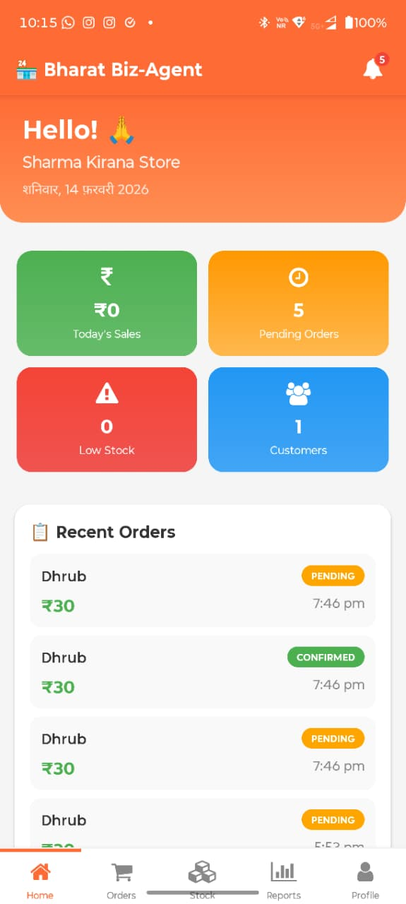
  &nbsp;&nbsp;
  
  &nbsp;&nbsp;
  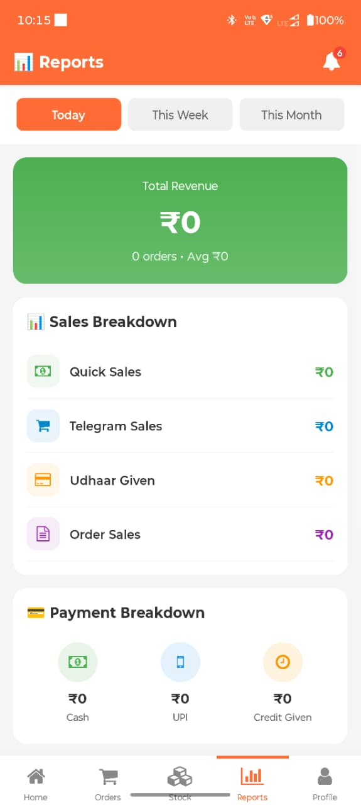
  &nbsp;&nbsp;
  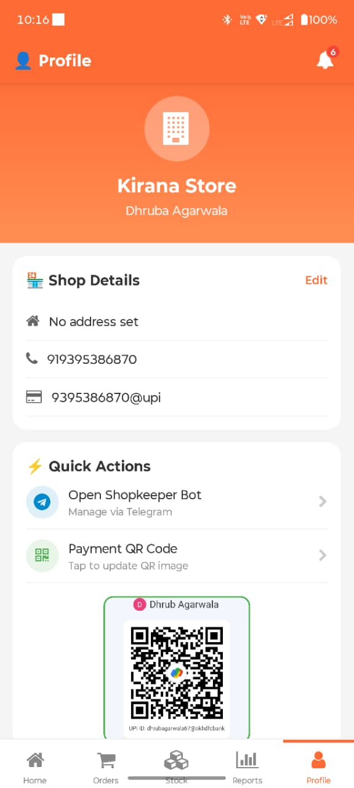
</p>

<p align="center">
  <em>Dashboard &bull; Inventory &bull; Reports &bull; Profile</em>
</p>

<details>
<summary><b>🏠 Dashboard Screen</b></summary>

- **Stats Grid** — Today's sales (₹), pending orders, low stock alerts, total customers
- **Recent Orders** — Last 5 orders with status badges and payment info
- **Quick Sale Modal** — Amount + optional customer name + optional item → `quick_transactions`
- **Quick Udhaar Modal** — Amount + customer name (required) + item → `quick_transactions`
- Auto-refreshes every 30s via `useAutoRefresh` hook

</details>

<details>
<summary><b>📦 Orders Screen</b></summary>

- **Filter Tabs** — Pending | Confirmed | Completed | Rejected | All
- **Order Cards** — Customer name, phone, status badge, time ago, total ₹
- **Payment Tracking** via `order_ongoing` — PAID / MISMATCH / AWAITING badges
- **Payment Warning Banners** for amount mismatches (amount paid vs expected)
- **Expandable Details** — Items list, UTR, sender, app, screenshot thumbnail (tappable)
- **Actions** — ✅ Confirm / ❌ Reject (pending) • Mark Complete (confirmed)
- Realtime subscriptions on `orders` + `order_ongoing`

</details>

<details>
<summary><b>📋 Inventory Screen</b></summary>

- **Search Bar** — Searches English + Hindi product names
- **Low Stock Alert** — Red banner with count of items below threshold
- **Product Cards** — Name (EN + HI), category, ₹ price/unit, stock ±1 buttons
- **Low Stock Indicator** — Red left border + "LOW" badge
- **Add/Edit Modal** — Name, Hindi name, category, price, stock, unit, threshold
- **Delete** with confirmation dialog

</details>

<details>
<summary><b>📊 Reports Screen</b></summary>

- **Period Selector** — Today | This Week | This Month
- **Revenue Card** (gradient) — Total revenue, order count, average order value
- **Sales Breakdown** — Quick Sales, Telegram, Udhaar, Order Sales
- **Payment Breakdown** — Cash, UPI, Credit
- **Pending Udhaar** — Top 5 debtors with amount + "Remind" button

</details>

<details>
<summary><b>👤 Profile Screen</b></summary>

- **Profile Header** (gradient) — Shop name, owner name
- **Editable Details** — Address, phone, UPI ID, GST number
- **Quick Actions** — Open Shopkeeper Bot, Upload UPI QR, Export Data
- **Language Toggle** — English / हिंदी with persistent preference
- **App Info** — Version, Help & Support link

</details>

<details>
<summary><b>🔔 Notifications Screen</b></summary>

- Fullscreen notification list (from header bell, not a tab)
- **Type-based icons** — 🛒 new_order (green), 💰 payment (blue), ⚠️ low_stock (red), ⏰ reminder (orange)
- **Unread indicator** — Orange left border + dot
- **Mark All Read** button
- Tap → mark read + navigate to relevant tab
- Realtime subscription for instant updates

</details>

### Core Libraries

| Module | Purpose |
|:---|:---|
| `supabase.ts` | Supabase client + `SHOP_ID` + TypeScript interfaces for all tables |
| `api.ts` | `confirmOrder()`, `rejectOrder()`, `recordQuickSale()`, `recordQuickUdhaar()`, Telegram deep links |
| `i18n.tsx` | `LanguageProvider` context — `lang`, `setLang`, `t()` — 50+ keys (EN/HI) |
| `notifications.ts` | Push token registration, foreground/background handlers, Supabase Realtime listener |
| `useAutoRefresh.ts` | Auto-refresh every 30s + refresh on screen focus |

---

<a name="database-schema"></a>
## 🗄️ Database Schema

### Core Tables

| Table | Purpose | Key Columns |
|:---|:---|:---|
| `shop_profiles` | Store details | owner_phone, shop_name, upi_id, gst_number, qr_image_url |
| `customers` | Customer records | name, phone, telegram_id, address, total_udhaar |
| `products` | Inventory items | name, name_hindi, category, price, stock, unit, low_stock_threshold |
| `orders` | Customer orders | customer_name, status, payment_status, total_amount |
| `order_items` | Line items | product_name, quantity, unit, price, subtotal (auto-calc) |
| `order_ongoing` | Order lifecycle | customer_telegram_id, items_json, payment_data, screenshot_url |
| `payments` | Payment records | amount, method, upi_screenshot_url |
| `udhaar_ledger` | Credit/debit ledger | type (credit/payment), amount, description |
| `sales` | Daily summary | total_orders, total_amount, cash/upi/credit split |
| `notifications` | Push records | type, title, body, is_read |
| `push_tokens` | Expo tokens | expo_push_token, device_info, is_active |
| `quick_transactions` | Walk-in sales | type (sale/udhaar), amount, customer_name, item_name |

### Database Features

| Feature | Details |
|:---|:---|
| **Triggers** | Auto-update `updated_at`, auto-calculate `subtotal`, auto-sync `total_udhaar` |
| **Row Level Security** | Enabled on all tables |
| **Realtime** | `orders`, `order_ongoing`, `notifications`, `products` |
| **Storage Buckets** | `shop-assets` (QR codes), `payment-screenshots` (payment proof) |
| **Unique Indexes** | `customers(shop_id, telegram_id)` for Telegram identity |

<details>
<summary><b>📜 Migration History (5 files)</b></summary>

| Migration | Description |
|:---|:---|
| `add_order_ongoing.sql` | `order_ongoing` table + indexes + RLS + realtime + trigger |
| `quick_transactions.sql` | `quick_transactions` for anonymous sales/udhaar |
| `add_telegram_id_to_customers.sql` | `telegram_id` + `address` columns + unique index |
| `add_qr_image.sql` | `qr_image_url` on `shop_profiles` + `shop-assets` bucket |
| `add_screenshot_storage.sql` | `screenshot_url` on `order_ongoing` + `payment-screenshots` bucket |

</details>

---

<a name="n8n-workflows--ai-agents"></a>
## 🤖 n8n Workflows & AI Agents

### 1️⃣ Customer Telegram Bot

> 🛒 AI-powered shopping assistant for customers

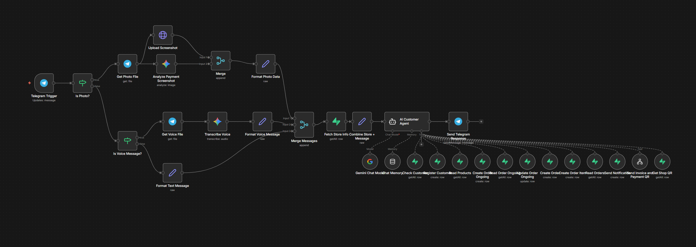

```
📩 Telegram Message
    ├── 📸 Photo? → Upload to Supabase → Gemini OCR → Payment Analysis
    ├── 🎙️ Voice? → Gemini Transcription → Text
    └── 💬 Text? → Direct
            ↓
    🔄 Merge → 🏪 Fetch Store Info → 🤖 AI Customer Agent → 📤 Reply
```

<details>
<summary><b>🧰 AI Agent Tool List (12 tools)</b></summary>

| Tool | Operation |
|:---|:---|
| Check Customer | Read `customers` by telegram_id |
| Register Customer | Create new customer record |
| Read Products | Search products by name (ilike) |
| Create Order Ongoing | Insert pre-payment order |
| Read Order Ongoing | Get pending order by telegram_id |
| Update Order Ongoing | Update payment status/data |
| Create Order | Insert confirmed order |
| Create Order Item | Add line items |
| Read Orders | Get customer's order history |
| Send Notification | Push to shopkeeper |
| Send Invoice & QR | Trigger sub-workflow |
| Get Shop QR | Fetch QR image URL |

</details>

**Key Behaviors:**
- 🆕 Auto-registers new customers (name, phone, address)
- 🛍️ Shows product catalog with prices and emojis
- 📋 Creates `order_ongoing` before payment → sends invoice + UPI QR
- 📸 Gemini OCR on payment screenshots → extracts UTR, amount, sender, app
- ✅ Amount match → `payment_verified` | ⚠️ Mismatch → `payment_warning`
- 🧠 Conversation memory: 20 messages/session | Temperature: 0.7

### 📱 Customer Bot in Action

<p align="center">
  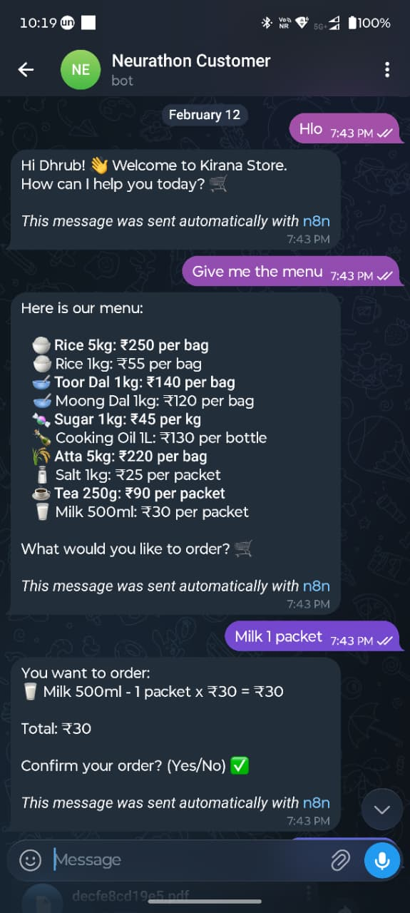
  &nbsp;&nbsp;
  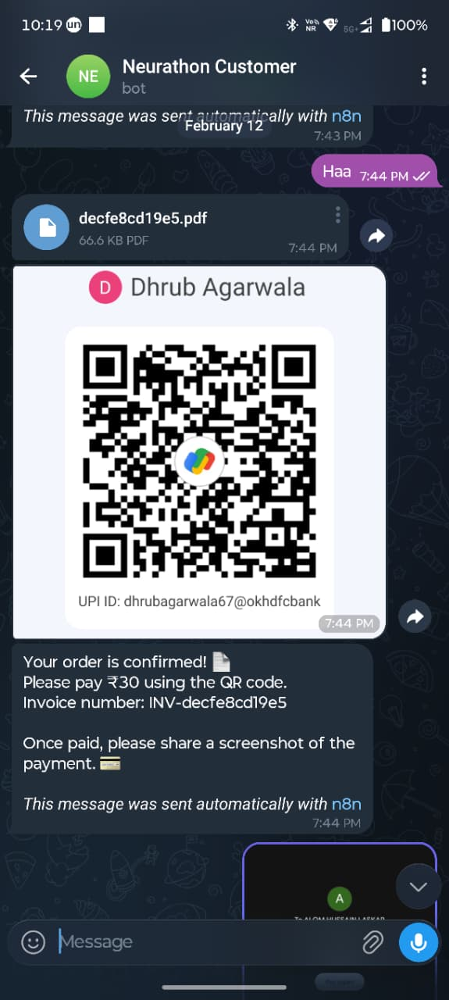
  &nbsp;&nbsp;
  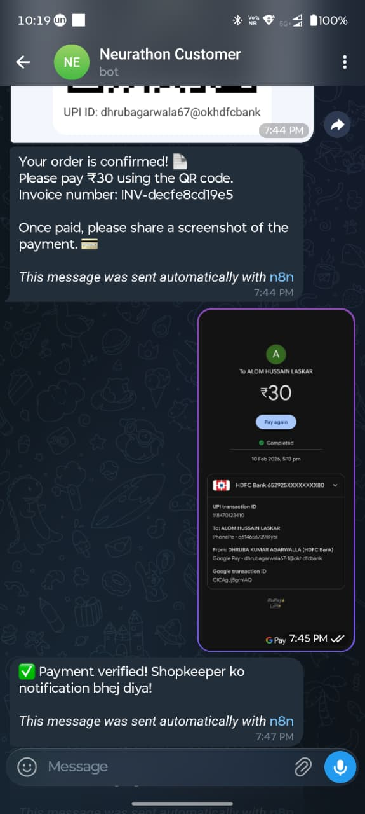
</p>

<p align="center">
  <em>Browse & Order &bull; Invoice + UPI QR &bull; Payment OCR Verification</em>
</p>

<p align="center">
  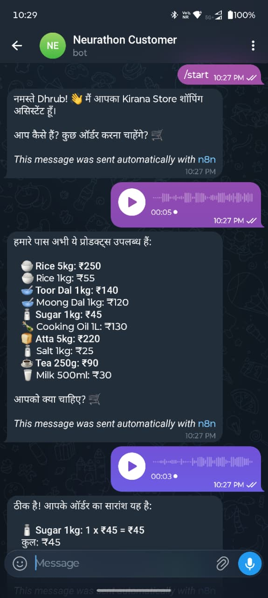
</p>

<p align="center">
  <em>🎙️ Voice ordering in Hindi — send a voice note, get instant results</em>
</p>

---

### 2️⃣ Shopkeeper Voice Bot

> 🎙️ Voice-first store management for the owner

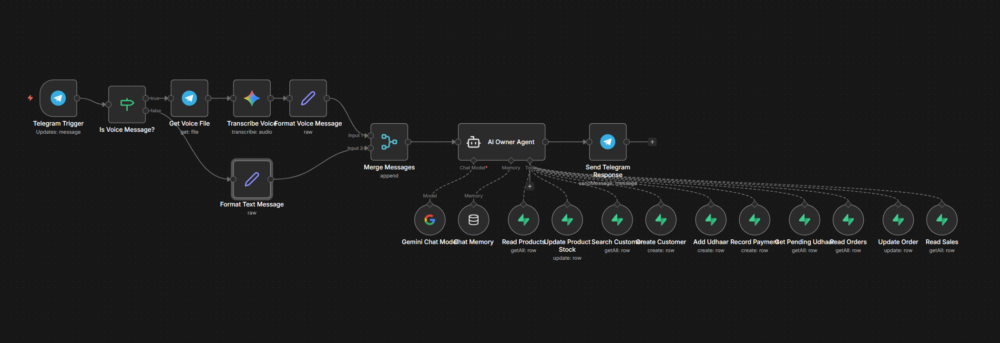

```
📩 Telegram Message
    ├── 🎙️ Voice? → Gemini Transcription → Hindi/Hinglish Text
    └── 💬 Text? → Direct
            ↓
    🤖 AI Owner Agent → 📤 Reply
```

<details>
<summary><b>🧰 AI Agent Tool List (10 tools)</b></summary>

| Tool | Operation |
|:---|:---|
| Read Products | Search inventory |
| Update Product Stock | Change stock quantity |
| Search Customer | Find by name |
| Create Customer | Add new customer |
| Add Udhaar | Record credit given |
| Record Payment | Record payment received |
| Get Pending Udhaar | List all debtors |
| Read Orders | Filter by status |
| Update Order | Change order status |
| Read Sales | Sales reports |

</details>

**Example Voice Commands:**
- 🗣️ *"Rice ka stock?"* → Shows rice inventory
- 🗣️ *"Amit ko 500 ka udhaar likho"* → Records ₹500 credit for Amit
- 🗣️ *"Aaj ka sales batao"* → Today's sales report
- 🧠 Conversation memory: 30 messages/session | Temperature: 0.5

---

### 3️⃣ Order Confirmation Webhook

> 🔔 Notifies customers when orders are confirmed/rejected from the app

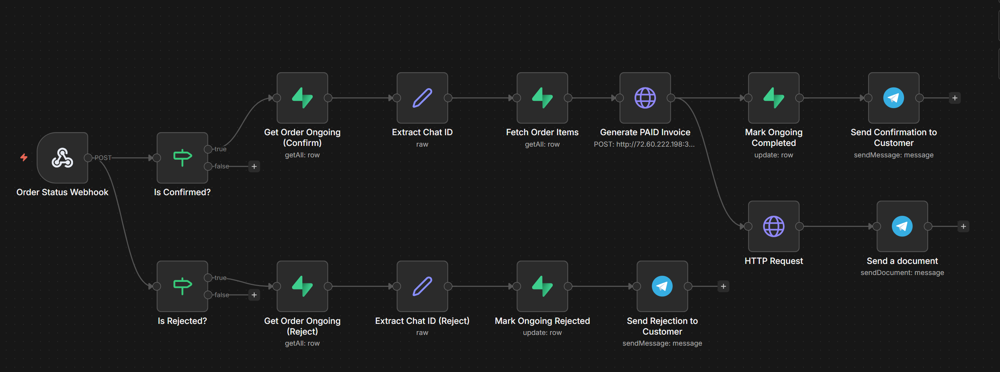

```
📡 Webhook (Order Status Change)
    ├── ✅ Confirmed → Get Details → Generate PAID Invoice → Send to Customer
    └── ❌ Rejected  → Mark Rejected → Notify Customer
```

---

### 4️⃣ Invoice & QR Sub-workflow

> 📄 Generates and sends invoice PDF + UPI QR code

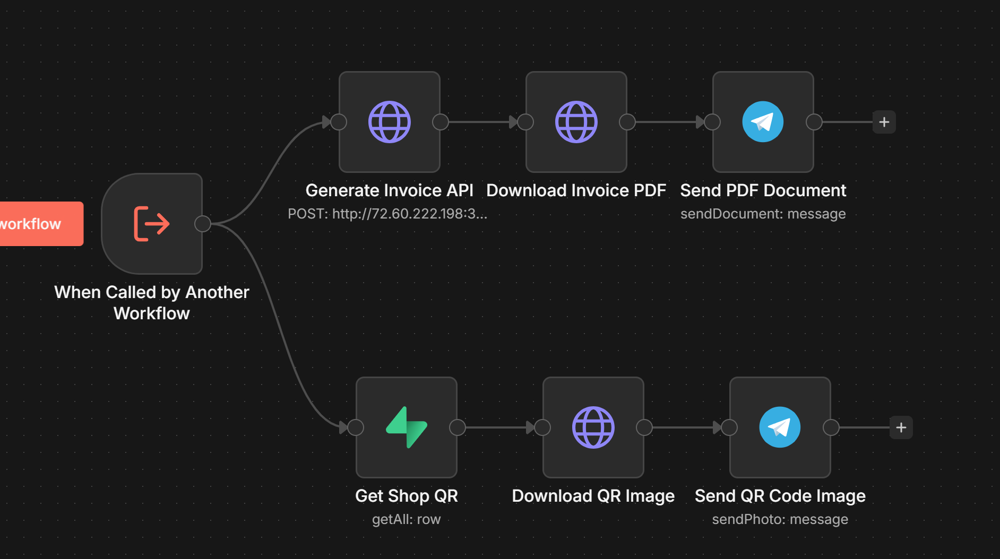

```
🔄 Called by Other Workflows
    ├── 📄 Generate Invoice (PDF API) → Download → Send via Telegram
    └── 📱 Get Shop QR (Supabase) → Download → Send via Telegram
```

---

<a name="pdf-invoice-api"></a>
## 📄 PDF Invoice API

<p align="center">
  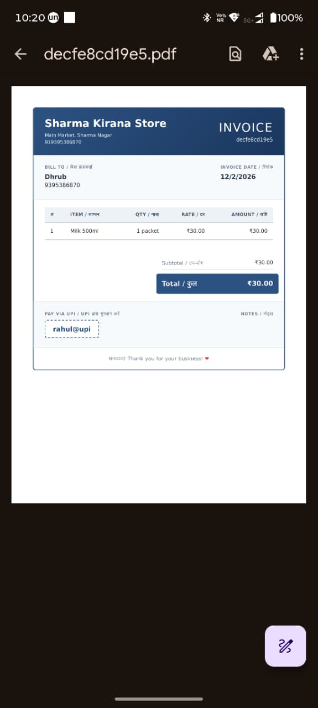
</p>

<p align="center">
  <em>Bilingual PDF Invoice (English + Hindi)</em>
</p>

| Component | Details |
|:---|:---|
| **Server** | Express.js on port 3001 |
| **PDF Engine** | Puppeteer (headless Chromium) |
| **Template** | Bilingual HTML (EN + HI labels) |
| **URL Shortener** | TinyURL API |
| **Endpoints** | `POST /api/invoice/generate` → `{ original_url, short_url }` |
| | `GET /invoices/:filename` → Static PDF serving |

<details>
<summary><b>📄 Invoice Template Features</b></summary>

- Shop + customer details header
- Itemized table (qty × unit price = subtotal)
- Payment status badge (PAID ✅ / UNPAID)
- UPI ID display
- Thank-you footer with shop branding
- Professional styling with system fonts

</details>

---

<a name="supabase-edge-functions"></a>
## 🔔 Supabase Edge Functions

<p align="center">
  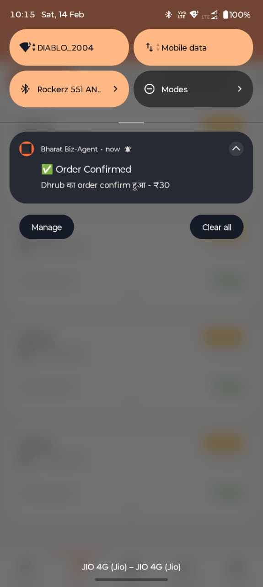
</p>

<p align="center">
  <em>Real-time push notification in Hindi</em>
</p>

### `send-push-notification`

| Attribute | Value |
|:---|:---|
| **Runtime** | Deno (Supabase Edge Functions) |
| **Trigger** | Database Webhook on `notifications` INSERT |
| **Push Service** | [Expo Push API](https://exp.host/--/api/v2/push/send) |
| **Error Handling** | Auto-deactivates stale `DeviceNotRegistered` tokens |

---

<a name="key-features"></a>
## ✨ Key Features

<table>
<tr>
<td width="50%">

### 🤖 AI-Powered Bots
- Google Gemini 2.5 Flash NLU
- Voice commands (Hindi/Hinglish/English)
- Payment screenshot OCR
- Conversational memory (20-30 msgs)

### 💳 Smart Payment Flow
1. Customer browses via Telegram
2. Bot sends invoice PDF + UPI QR
3. Customer pays & sends screenshot
4. Gemini OCR verifies payment
5. Shopkeeper confirms via app
6. Customer gets paid invoice

</td>
<td width="50%">

### 📱 Mobile Dashboard
- Real-time updates (Supabase Realtime)
- Push notifications (Expo + Edge Functions)
- Swipe navigation (MaterialTopTabs)
- Bilingual UI (EN / हिंदी)
- Quick sale & udhaar recording

### 📊 Business Analytics
- Period-based reports (day/week/month)
- Sales breakdown by source
- Payment method breakdown
- Pending udhaar tracking
- Top debtor customer lists

</td>
</tr>
</table>

---

<a name="quick-start"></a>
## 🚀 Quick Start

### Prerequisites

| Requirement | Version |
|:---|:---|
| Node.js | 20+ |
| Expo CLI | Latest |
| Supabase | Account + Project |
| n8n | Self-hosted or Cloud |
| Telegram | 2 Bots via @BotFather |
| Google AI | Gemini API Key |

### 1️⃣ Mobile App

```bash
cd app
cp .env.example .env        # Fill in your Supabase credentials
npm install
npx expo start               # Scan QR with Expo Go
```

### 2️⃣ Database

```bash
# In Supabase SQL Editor:
# 1. Run database/supabase_schema.sql
# 2. Run each migration in database/migrations/ (in order)
# 3. Create storage buckets: shop-assets (public), payment-screenshots (public)
# 4. Set up Database Webhook: notifications INSERT → send-push-notification
```

### 3️⃣ PDF Invoice API

```bash
cd pdf-invoice-api
cp .env.example .env         # Set HOST and PORT
npm install
node server.js               # Runs on port 3001
```

### 4️⃣ Edge Functions

```bash
supabase functions deploy send-push-notification
supabase secrets set SUPABASE_URL=<your-url> SUPABASE_SERVICE_ROLE_KEY=<your-key>
```

### 5️⃣ n8n Workflows

```
1. Import each JSON from workflows/ into n8n
2. Configure credentials: Telegram Bot, Supabase, Google Gemini
3. Activate all 4 workflows
```

---

<a name="environment-variables"></a>
## ⚙️ Environment Variables

<details>
<summary><b>View all environment variables</b></summary>

### Mobile App (`app/.env`)

| Variable | Description |
|:---|:---|
| `EXPO_PUBLIC_SUPABASE_URL` | Supabase project URL |
| `EXPO_PUBLIC_SUPABASE_ANON_KEY` | Supabase anonymous key |
| `EXPO_PUBLIC_SHOP_ID` | Shop UUID |

### PDF Invoice API (`pdf-invoice-api/.env`)

| Variable | Default | Description |
|:---|:---|:---|
| `PORT` | 3001 | Server port |
| `HOST` | 0.0.0.0 | Bind address |

### Supabase Edge Functions

| Variable | Description |
|:---|:---|
| `SUPABASE_URL` | Supabase project URL |
| `SUPABASE_SERVICE_ROLE_KEY` | Service role key (full access) |

### n8n Credentials (via Credential Manager)

- Telegram Bot Token (Customer Bot)
- Telegram Bot Token (Shopkeeper Bot)
- Supabase API credentials
- Google Gemini API Key

</details>

---

<a name="security-considerations"></a>
## 🔒 Security Considerations

> [!WARNING]
> **Production hardening checklist — address before deploying:**

| Item | Status | Action Required |
|:---|:---:|:---|
| RLS Policies | ⚠️ | Tighten from `USING (true)` to shop_id ownership checks |
| Credentials | ✅ | Migrated to `.env` files (excluded from git) |
| Service Role Key | ✅ | Edge Function environment secrets only |
| Storage Policies | ⚠️ | Restrict public read/write on buckets |
| n8n Security | ⚠️ | Ensure n8n instance is properly secured |

---

<a name="future-roadmap"></a>
## 🗺️ Future Roadmap

- 🏪 Multi-store support with role-based access
- 📈 AI-powered inventory predictions & auto-reorder
- 💯 Customer credit scoring
- 📱 WhatsApp Business API integration
- 🧾 GST-compliant invoice generation
- 🚚 Delivery tracking with rider assignment
- ⭐ Customer loyalty & rewards program

---

<div align="center">

### Built for 🏆 Neurathon 2026

Made with ❤️ for Indian Kirana Stores 🇮🇳

---

**⭐ Star this repo if you found it useful!**

</div>
